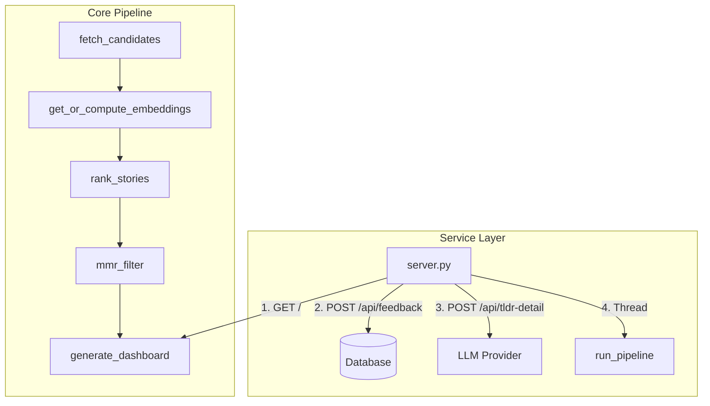

# Architecture & Design: hn-rewrite

This document outlines the architecture, core design decisions, database schema, ranking system, and maintenance instructions for the `hn-rewrite` minimalist local-first Hacker News reranking dashboard.

---

## 1. System Overview

`hn-rewrite` is a unified, resource-efficient rewrite of the original reranking system. It functions as a local-first web application that fetches stories from Hacker News and multiple RSS feeds, semantic-ranks them using a locally run sentence-embedding model and SVM, and presents them in a clean web dashboard.



---

## 2. Component Layout

The codebase consists of five primary modules:

1. **[database.py](file:///home/dev/hn-rewrite/database.py)**: Encapsulates all SQLite interactions. Manages schemas, cascade-deletes, pruned retention rules, and automatic schema migrations.
2. **[pipeline.py](file:///home/dev/hn-rewrite/pipeline.py)**: Orchestrates the background update sequence. Integrates RSS parsed feeds, computes text embeddings using ONNX, fits the SVM, and generates the final dashboard.
3. **[server.py](file:///home/dev/hn-rewrite/server.py)**: A multi-threaded web server serving the static dashboard, handling feedback writes, proxying detailed TLDR summaries to LLM APIs, and housing the background regeneration event thread.
4. **[templates/index.html](file:///home/dev/hn-rewrite/templates/index.html)**: Jinja2 dashboard template styled with a compact dark-theme Pico CSS layout. Includes client-side sorting, autohide transitions, and asynchronous detailed analysis rendering.
5. **[migrate_feedback.py](file:///home/dev/hn-rewrite/migrate_feedback.py)**: Imports legacy feedback data from `hn_rerank` JSON files, backfilling candidate story contents and caching embeddings.

---

## 3. Key Design Decisions

### 3.1 Normalized Schema & Data Integrity
To eliminate data redundancy, the feedback schema is strictly normalized. Metadata (`title`, `url`, `text_content`, `source`) is not duplicated in the `feedback` table. Instead, a foreign key references `stories(id)`. 
To prevent constraint violations or data loss during cleanup:
* `prune_stories` leaves feedback-associated stories intact (`id NOT IN (SELECT story_id FROM feedback)`).
* `get_all_feedback` and `get_feedback_for_training` perform a `LEFT JOIN` against `stories` to resolve attributes dynamically.

### 3.2 386-Dimensional Feature Space
Rather than mixing semantic matches with engagement counts using arbitrary manual weights, we feed them directly into the Support Vector Machine (SVM). The model trains on a **386-dimensional feature vector**:
* **`[0-383]` (384-d)**: MiniLM sentence embedding of `text_content`.
* **`[384]` (1-d)**: Normalized log points: `min(log1p(score), 8.0) / 8.0`.
* **`[385]` (1-d)**: Normalized age: `min(age_days, 30.0) / 30.0`.
  * **For training**: `age_at_vote = vote_time - story_time`.
  * **For candidates**: `age_now = now - story_time`.

### 3.3 Removal of HN Profile Scraping
Periodic scraping of a user's HN profile (upvoted, favorited, hidden lists) was a bottleneck, taking ~10 seconds of network calls. We bypassed profile scraping during dashboard regeneration, querying cached exclusions from `user_signals` and active feedback instead.

### 3.4 Engagement-Aware MMR Filtering
Standard MMR (Maximal Marginal Relevance) strictly penalizes topic duplication based on similarity. If two stories are similar, the lower-ranked one is discarded. We modified `mmr_filter` to identify similarity groups. If an alternative candidate has significantly higher engagement than the group leader:
```python
other_engagement > leader_engagement * 2.0 + 30
```
the higher-engagement candidate is promoted as the representative for the cluster. The final set is sorted back to match original SVM relative rank order.

### 3.5 Client-side Autohide
When a user upvotes/downvotes a card, the UI writes the current card height inline, triggers a CSS collapse transition (`max-height: 0 !important; opacity: 0;`), and removes the card from the DOM after 400ms. The background thread updates the actual static page asynchronously.

---

## 4. LLM Detailed Analysis

The detailed summary endpoint `/api/tldr-detail` proxies requests to Mistral or Groq using the token details stored in the `.env` file. It compiles the story title and up to **30,000 characters** of the story content and top comments, requesting a 3-4 paragraph Markdown output.

On the client-side, the raw Markdown response is formatted on the fly using a robust, line-by-line parser (`parseSimpleMarkdown`) to render headers, bold text, and lists safely.

---

## 5. Maintenance Guide

### 5.1 Service Control
The server runs as a systemd user service.
```bash
# Manage the service
systemctl --user {status|start|stop|restart} hn_rewrite.service

# View active logs
journalctl --user -u hn_rewrite.service -f -n 100
```

### 5.2 Verification Suite
Ruff and Pytest are configured for standard validation.
```bash
# Run all unit tests
uv run pytest tests/

# Check styling and types
uv run ruff check .
```
